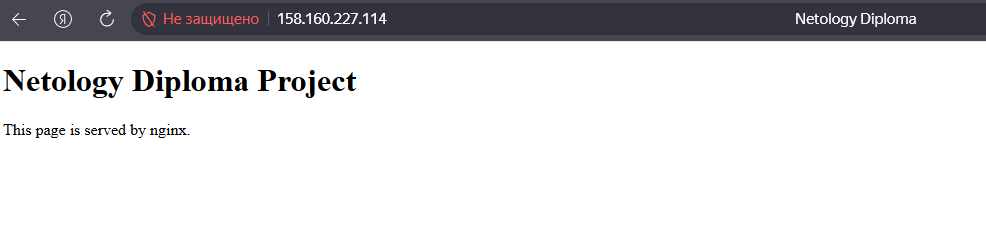
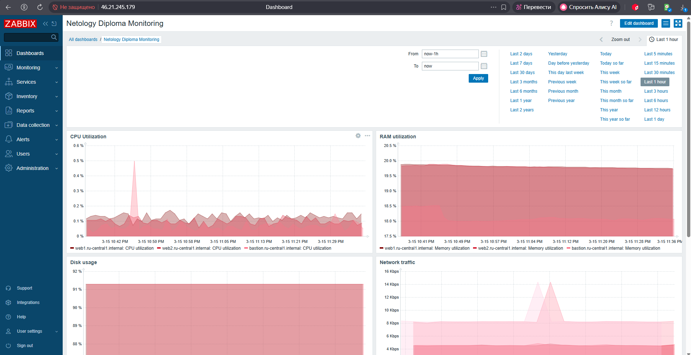
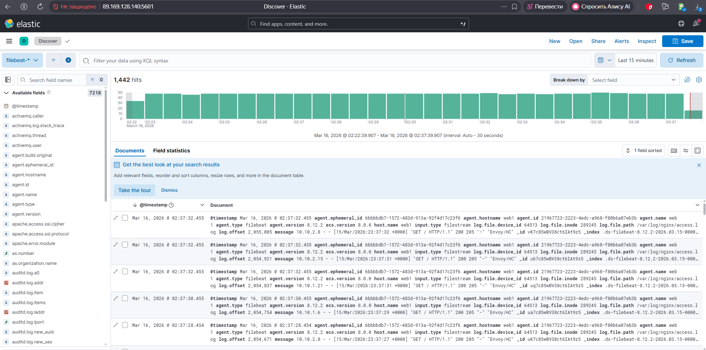
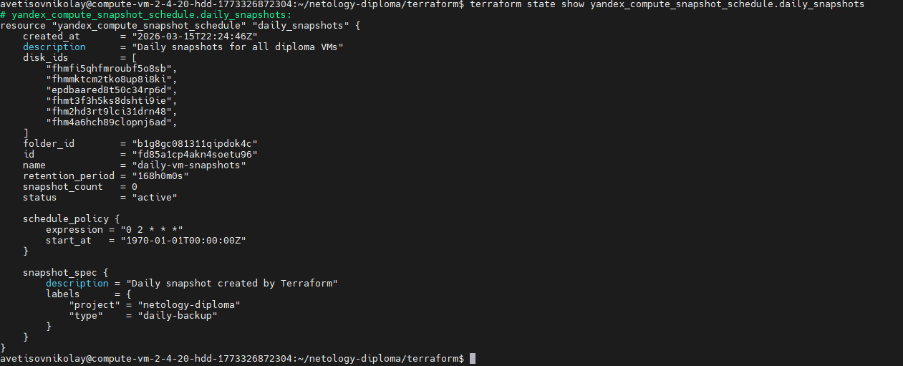

# Netology DevOps Diploma  
## Infrastructure deployment in Yandex Cloud

Автор: Николай Аветисов

---

# Описание проекта

Цель дипломной работы — развернуть инфраструктуру в Yandex Cloud с использованием Terraform и Ansible.

В рамках проекта реализованы:

- инфраструктура в Yandex Cloud
- автоматизация конфигурации через Ansible
- мониторинг через Zabbix
- централизованное логирование через Elasticsearch и Kibana
- балансировка нагрузки через Application Load Balancer
- резервное копирование дисков через snapshot policy

---

# Используемые технологии

- Terraform
- Ansible
- Yandex Cloud
- Zabbix
- Elasticsearch
- Kibana
- Filebeat
- Nginx

---

# Архитектура инфраструктуры

                 Internet
                    │
                    │
          Application Load Balancer
                    │
         ┌──────────┴──────────┐
         │                     │
       web1                  web2
         │                     │
         └──────────┬──────────┘
                    │
              Elasticsearch
                    │
                  Kibana

Monitoring
│
Zabbix

Administration
│
Bastion host


---

# Сетевая архитектура

Создан один VPC:

diploma-vpc


Подсети:

| Подсеть | Назначение |
|------|------|
| subnet-a | web1, zabbix |
| subnet-b | web2 |

Публичные сервисы:

- Bastion
- Zabbix
- Kibana
- Application Load Balancer

Приватные сервисы:

- web1
- web2
- Elasticsearch

---

# Bastion host

Bastion host используется как точка входа для администрирования инфраструктуры.

На bastion host установлен Ansible.

С bastion host выполняются playbook для конфигурации всех серверов в приватной сети.

Это соответствует требованиям задания, где допускается запуск Ansible непосредственно с bastion host.

---

# Web инфраструктура

Развернуты два web сервера:

- web1
- web2

На серверах установлен nginx.

Сайт разворачивается через Ansible.

Проверка балансировки:

curl http://158.160.227.114


---

# Мониторинг

Развернут сервер мониторинга:

Zabbix

На всех VM установлен:

zabbix-agent

Настроен dashboard по принципу USE:

- CPU utilization
- Memory usage
- Disk usage
- Network traffic
- HTTP availability

---

# Централизованное логирование

Реализован стек логирования:

Filebeat → Elasticsearch → Kibana

Filebeat установлен на:

- web1
- web2

Отправляются логи:

/var/log/nginx/access.log
/var/log/nginx/error.log


Просмотр логов осуществляется через Kibana.

---

# Резервное копирование

Настроено резервное копирование дисков виртуальных машин через Terraform.

Используется ресурс:

yandex_compute_snapshot_schedule


Политика резервного копирования:

- snapshot выполняется ежедневно
- хранение snapshot — 7 дней

---

# Infrastructure as Code

Terraform используется для создания:

- VPC
- подсетей
- виртуальных машин
- Application Load Balancer
- NAT Gateway
- snapshot schedule

---

# Configuration management

Ansible используется для конфигурации серверов.

Playbooks:

| Playbook | Назначение |
|------|------|
| playbook.yml | установка nginx |
| zabbix_server.yml | установка Zabbix server |
| zabbix_agent.yml | установка Zabbix agent |
| elasticsearch.yml | установка Elasticsearch |
| kibana.yml | установка Kibana |
| filebeat.yml | установка Filebeat |

---

# Структура проекта

```
netology-diploma
├── terraform
│   ├── main.tf
│   ├── provider.tf
│   └── variables.tf
│
├── ansible
│   ├── ansible.cfg
│   ├── inventory.ini
│   ├── playbook.yml
│   ├── zabbix_server.yml
│   ├── zabbix_agent.yml
│   ├── elasticsearch.yml
│   ├── kibana.yml
│   └── filebeat.yml
│
├── site
│   └── index.html
│
└── README.md
```
Terraform запускается с control VM.

Ansible playbooks выполняются с bastion host.

# Доступ к сервисам

## Application Load Balancer
http://158.160.227.114

## Zabbix
http://62.84.113.156/zabbix/

## Kibana
http://89.169.153.152:5601

## Bastion host

Публичный IP:
89.169.132.19

## Elasticsearch

Elasticsearch размещён в приватной подсети и не имеет публичного IP.

Проверка выполняется с bastion host:

curl http://elasticsearch.ru-central1.internal:9200

---

# Скриншоты

## Application Load Balancer



## Zabbix Dashboard



## Kibana Logs



## Snapshot policy



